  

  

  <a href="https://www.linkedin.com/in/krishna-agarwal-2133ba379">LinkedIn</a>
  &nbsp;&nbsp;/&nbsp;&nbsp;
  <a href="mailto:ka8093546@gmail.com">Email</a>
  &nbsp;&nbsp;/&nbsp;&nbsp;
  <a href="https://github.com/Krishna-Agarwal04">GitHub</a>

 

  

## About

Artificial Intelligence Engineer and Full Stack Developer from India.  
I build intelligent systems that combine clean product thinking with reliable engineering.  
My work sits across AI, web platforms, cloud infrastructure, and polished developer experiences.  
Focused on useful software, sharp interfaces, and systems that scale with clarity.

  

## Tech Stack

  

<table>
  <tr>
    <td align="center" width="33%">
      <strong>Intelligence</strong>
        
      
    </td>
    <td align="center" width="33%">
      <strong>Product Engineering</strong>
        
      
    </td>
    <td align="center" width="33%">
      <strong>Systems</strong>
        
      
    </td>
  </tr>
</table>

 

  

## GitHub Analytics

  
  

  

## Contribution Graph

  

  <picture>
    <source media="(prefers-color-scheme: dark)" srcset="https://raw.githubusercontent.com/Krishna-Agarwal04/Krishna-Agarwal04/output/github-contribution-grid-snake-dark.svg" />
    
  </picture>

## Learning

  

## Contact

  <a href="https://www.linkedin.com/in/krishna-agarwal-2133ba379">linkedin.com/in/krishna-agarwal-2133ba379</a>
   
  <a href="mailto:ka8093546@gmail.com">ka8093546@gmail.com</a>

  

