  

  

  
  &nbsp;&nbsp;
  
  &nbsp;&nbsp;
  

 

## About Me

I am a **Full Stack Developer** and **Python Programmer** based in India. I specialize in building responsive web applications and clean backend logic. My focus is on creating simple, high-performing user experiences and reliable code.

  

---

## Tech Stack

Here are the core technologies I work with:

<table align="center" width="100%">
  <tr>
    <td align="center" width="33%" valign="top">
      <h4>🧠 Python Dev</h4>
      
Backend &amp; Scripting

      
    </td>
    <td align="center" width="33%" valign="top">
      <h4>💻 Web Engineering</h4>
      
Frontend &amp; Server development

      
    </td>
    <td align="center" width="33%" valign="top">
      <h4>⚙️ Tools</h4>
      
Version Control &amp; Collaboration

      
    </td>
  </tr>
</table>

---

## GitHub Analytics

  
  &nbsp;&nbsp;
  

  

### Contribution Activity

  

  <picture>
    <source media="(prefers-color-scheme: dark)" srcset="https://raw.githubusercontent.com/Krishna-Agarwal04/Krishna-Agarwal04/output/github-contribution-grid-snake-dark.svg" />
    
  </picture>

---

## Learning Focus

I'm currently sharpening my skills and expanding my domain knowledge in:
- 💻 **Frontend Engineering** — Tuning React/Next.js bundle sizes and responsive web design.
- 🐍 **Python Scripts** — Automation, web scraping, and writing utility scripts.
- ⚙️ **Git Workflows** — Clean commit patterns, branch strategy, and team collaboration.

---

## Get In Touch

If you want to collaborate on a project, chat about development, or just say hi, feel free to reach out!

  📧 <strong>Email:</strong> <a href="mailto:ka8093546@gmail.com">ka8093546@gmail.com</a>
  &nbsp;&nbsp;&bull;&nbsp;&nbsp;
  💼 <strong>LinkedIn:</strong> <a href="https://www.linkedin.com/in/krishna-agarwal-2133ba379">linkedin.com/in/krishna-agarwal-2133ba379</a>

   
  Designed &amp; Built with ☕ &amp; code. © 2026 Krishna Agarwal

